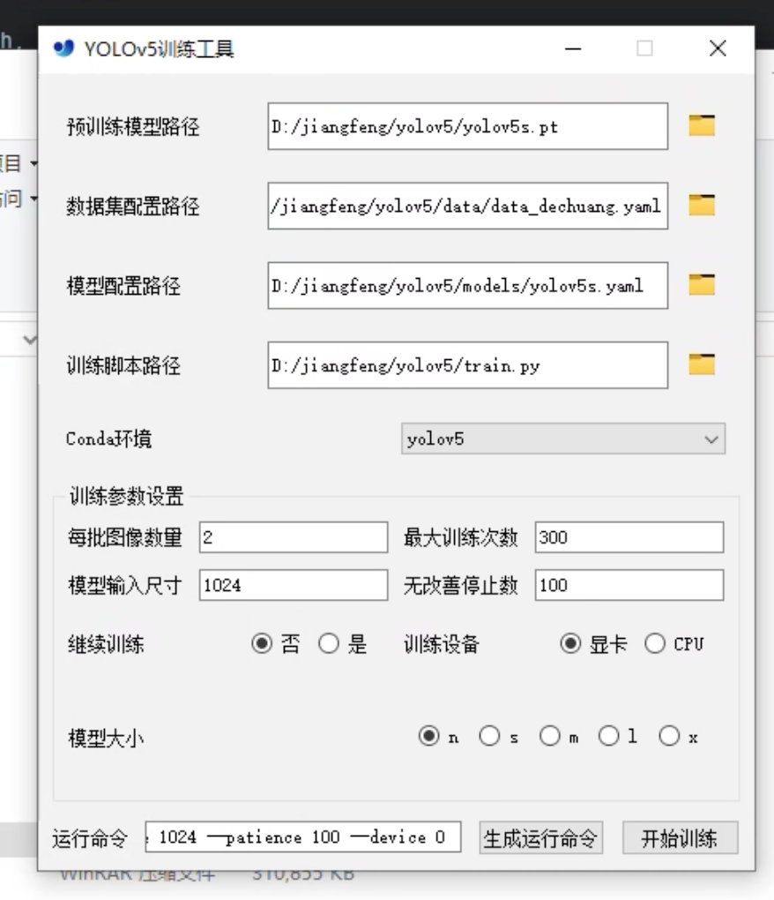

## yolov5的训练助手，选择相关路径后可以快速开始训练


## 介绍
### 自动加载conda环境
使用bat脚本获取所有conda环境以便选择
### 记忆之前的选择，下次打开软件时会恢复选择

## 使用pyinstaller进行打包
```
pyinstaller --onefile --windowed --add-data 'get_conda_envs.bat;.' -i 'app.ico' -n 'YOLO训练助手' main.py
```